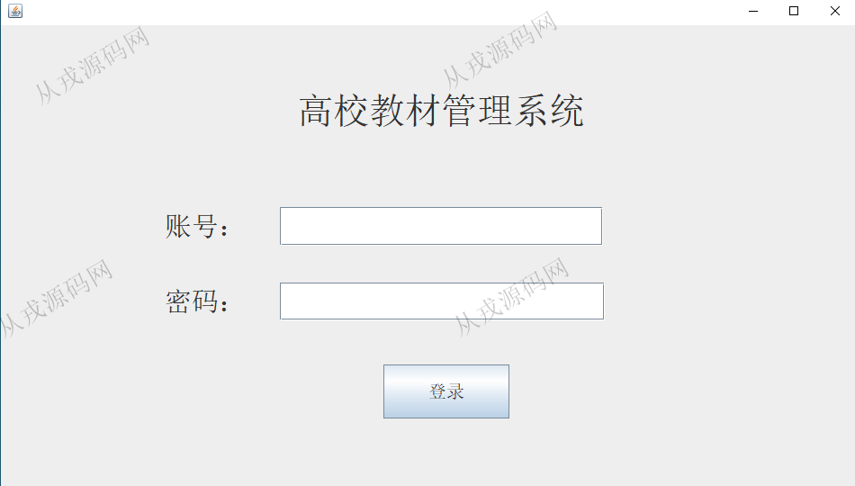

<h1 align="center">219.高校教材仓库管理系统</h1>

 获取sql文件 QQ: 386869957 QQ群: 377586148 

 [更多源码项目: 从戎源码网](https://armycodes.com/) 

## 简介

> 本代码来源于网络,仅供学习参考使用!
>
> 提供1.远程部署/2.修改代码/3.设计文档指导/4.框架代码讲解等服务
>
> admin 123456
>

## 项目介绍
基于java+swing的高校教材仓库管理系统：集成教材管理、班级管理、出版社管理、订购管理、出入库管理、统计等功能于一体的系统。

## 功能介绍

- 教材管理：教材信息的增删改查
- 班级管理：班级信息的增删改查
- 出版社管理：出版社增删改查
- 仓库人员管理：仓库人员的增删改查
- 订购管理：订购信息的增删改查
- 入库管理：教材入库，查询入库信息，入库表信息
- 出库管理：教材出库，查询出库信息，出库表信息
- 库存管理：库存查询
- 统计：订购入库出库统计

## 环境

- <b>IntelliJ IDEA 2021.3</b>

- <b>Mysql 5.7.26</b>

- <b>JDK 1.8</b>

## 运行截图

